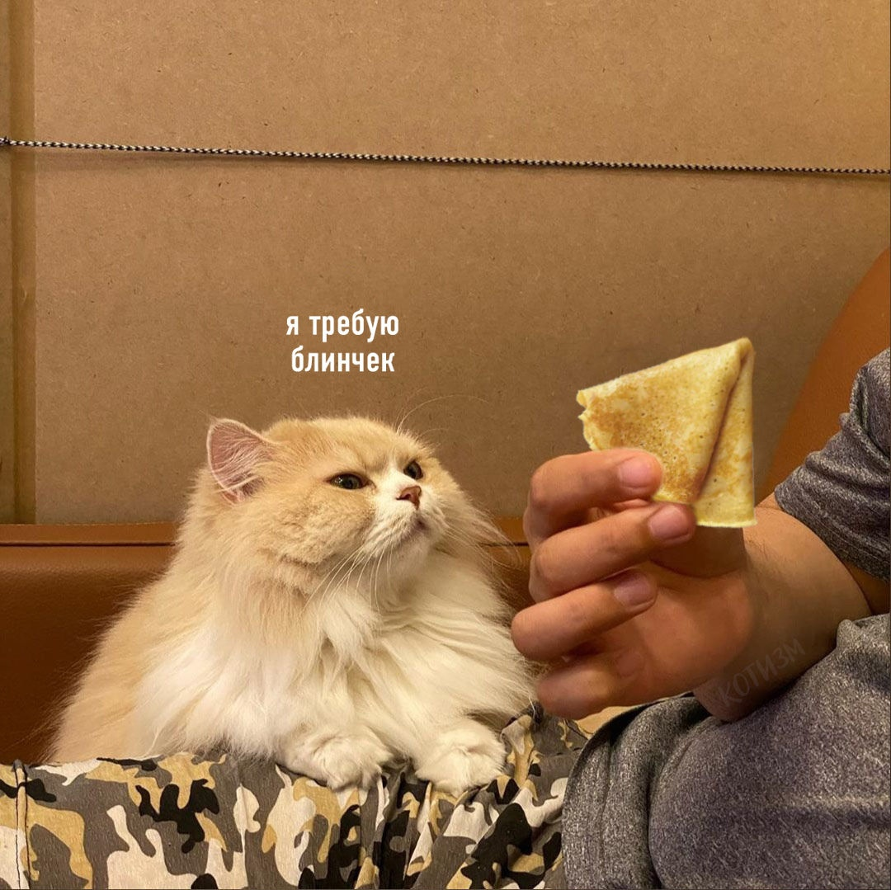

# koti<<!DOCTYPE html>
<html lang="en" dir="ltr">
  <head>
    <meta charset="utf-8">
    <title>Покорми Коську</title>
    <meta name="keywords" content="Коськи - это очень важно">
    <meta name="description" content="Коськи правят миром <3">
  </head>
  <body>
<h1> Если ты не кормишь коську - ты чмо!</h1>
  </body>
  <
</html>
